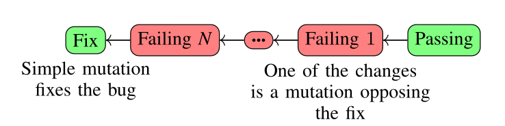
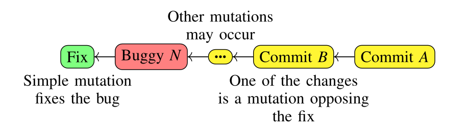

The main idea we want to deliver is that the *semantics* behind a *bug*
can guide the repair process of a program. To show this, we used
*Morpheus* to analyze *Bugswarm* and *Defects4J*, extracting 10 case
studies from these repositories. These experiments are available for
replication:
- [Bugswarm case studies](https://github.com/FranciscoRibeiro/bugswarm-case-studies)
- [Defects4J case studies](https://github.com/FranciscoRibeiro/d4j-case-studies)

## Bugswarm Case Studies

We used 5 programs from *Bugswarm* in this paper. For each one, we
detected that a simple fix, susceptible of being represented by a
mutation, makes the program pass every test. We then searched back
through the commit history and looked for the most recent commit which
began failing these tests. There, we detected mutations consisting of
the opposite modification that fixed the bug, which likely introduced
it.



#### [Traccar](https://github.com/traccar/traccar)

In this case, the bug was fixed after the developer changed the *==*
sign to *!=*.

<div id="lst:traccar_fix">

```
83c83
<      if (channel ||==|| null) {
---
>      if (channel **!=** null) {
```
Listing
<a href="#lst:traccar_fix" data-reference-type="ref" data-reference="lst:traccar_fix">1</a> - Fix: relational operator replacement

</div>

The `RelationalOperatorReplacement` operator, when applied to the buggy
version of this program (*==*), is capable of producing the fixed
version (*!=*). If we looked at the commit responsible for introducing
the bug, we would see that a total of 20 lines were modified.
Furthermore, a typical spectrum-based fault localization (SFL) technique
ranks 36 lines tied as the top-1 suspect. From the buggy version,
*Morpheus* detects the occurrence of 12 mutation operators, one being
the *relational operator replacement*.

<div id="lst:traccar_bug">

```
81c83
<      if (channel ||!=|| null) {
---
>      if (channel **==** null) {
```

Listing
<a href="#lst:traccar_bug" data-reference-type="ref" data-reference="lst:traccar_bug">2</a> - Bug: relational operator replacement

</div>

With this scenario, we can see that if we make the repair process focus
in the lines where mutations are inferred to have taken place, we arrive
at the desired patch more efficiently.

<div id="tab:traccar_comp">

|   **Mutation Operator**   | `RelationalOperatorReplacement` |
|:-------------------------:|:-------------------------------:|
|  **Start-End New Lines**  |             `83-83`             |
| **Start-End New Columns** |             `21-35`             |

Table
<a href="#tab:traccar_comp" data-reference-type="ref" data-reference="tab:traccar_comp">1</a> - Mutation’s location: *Traccar* project

</div>

Table
<a href="#tab:traccar_comp" data-reference-type="ref" data-reference="tab:traccar_comp">1</a>
shows the mutation, out of the 12 detected, that needs to be fixed to
eliminate the bug. For this particular case, there is no difference in
choosing between efficacy and efficiency when selecting nodes from the
AST. The repair strategy generates 41 patches if all nodes in the
reported lines are collected and 39 patches if both columns and lines
are used to to collect nodes. Both criterias are able to fix the bug by
producing the desired fix in Listing
<a href="#lst:traccar_fix" data-reference-type="ref" data-reference="lst:traccar_fix">1</a>.
For this case study, there was no advantage in generating patches based
on method names or relative lines, as the first is less efficient, thus
generating unnecessary patches (277) and the second one is equivalent to
considering absolute line numbers (41).

#### [MyBatis](https://github.com/mybatis/mybatis-3)

This bug fix consists of changing the variable from *select* to
*options*.

<div id="lst:mybatis_fix">

```
342c342
<      ||select|| != null ? nullOrEmpty(options.resultSets()) : null);
---
>      **options** != null ? nullOrEmpty(options.resultSets()) : null);
```

Listing
<a href="#lst:mybatis_fix" data-reference-type="ref" data-reference="lst:mybatis_fix">3</a> - Fix: variable replacement

</div>

This kind of transformation consists of replacing a variable with
another variable of the same type and in scope. Again, by looking at the
commit which introduced this bug, we can assess that it consisted of 4
changed source files, with a total of 5 added lines and 4 deleted ones.
The SFL report does not help in identifying the culprit line, as for
this case, line 342 does not show up in the ranking. But if *Morpheus*
is used over the diff which caused the bug, it can successfully detect
the occurrence of a *variable replacement* in the buggy line.

<div id="lst:mybatis_bug">

```
342c342
<      select != null ? nullOrEmpty(||select||.resultSets()) : null);
---
>      select != null ? nullOrEmpty(**options**.resultSets()) : null);
```
Listing
<a href="#lst:mybatis_bug" data-reference-type="ref" data-reference="lst:mybatis_bug">4</a> - Bug: variable replacement

</div>

Curiously, the variable change occurs in a different part of the line
than the one in the fix. Nonetheless, by knowing about the mutation
operator behind the bug, the repair process could apply a similar
transformation over various elements in that same line. This is an
instance where collecting AST nodes with efficacy in mind is the only
path leading to the generation of the fix.

<div id="tab:mybatis_comp">

| **Mutation Operator** | `VarToVarReplacement` |
|:---------------------:|:---------------------:|
|  **Start-End Lines**  |       `342-342`       |
| **Start-End Columns** |        `40-46`        |

Table
<a href="#tab:mybatis_comp" data-reference-type="ref" data-reference="tab:mybatis_comp">2</a> - Mutation’s location: *MyBatis* project

</div>

Table
<a href="#tab:mybatis_comp" data-reference-type="ref" data-reference="tab:mybatis_comp">2</a>
shows the location of the only modification that could be translated in
terms of a mutation operator. The inferred mutation was
`VarToVarReplacement` and this operator is its own opposite. As such,
the strategy will attempt to change variable names where possible.
Columns 40 to 46 represent the highlighted variable in Listing
<a href="#lst:mybatis_bug" data-reference-type="ref" data-reference="lst:mybatis_bug">4</a>.
However, according to Listing
<a href="#lst:mybatis_fix" data-reference-type="ref" data-reference="lst:mybatis_fix">3</a>,
the fix is located in the beginning of the line. Thus, is does not occur
inside that column range. Trying to mutate AST nodes located in that
specific part (line 342 and colums 40 to 46) leads to the generation of
30 patches, with none of them being able to fix the issue. On the other
hand, by considering all the AST nodes in line 342, even though we
double the amount of patches by generating 60 in total, we are able to
automatically produce the fix. Mutating every node inside the respective
methods lead to an `OutOfMemoryError` due to the high number of nodes
being analyzed. However, we are confident this approach we would not
yield good results, as 191 patches had been generated until the failure,
with none of them corresponding to the fix. Using relative lines also
fixes the bug by producing 60 patches.

The SFL report did not include the faulty line, meaning our approach is
more effective at generating the fix.

#### [ZXing](https://github.com/zxing/zxing)

The patch for this specific bug was obtained after the developer changed
the variable *e1* to the constant *1*.

<div id="lst:zing_fix">

```
46c46
<     for (int i = 0; i < modulus - ||e1||; i++) {
---
>     for (int i = 0; i < modulus - **1**; i++) {
```
Listing
<a href="#lst:zxing_fix" data-reference-type="ref" data-reference="lst:zxing_fix">5</a> - Fix: variable to constant replacement

</div>

The `VarToConsReplacement` operator can reproduce this transformation.
As such, this fix could be recreated by automating the application of
such a change in this area of the code. In this case, the commit
introducing the bug modified a total of 44 source files, 2 configuration
files, added 186 lines and deleted 163 lines. It is not possible to
generate an SFL report for this bug because the code fails to compile,
as variable *e1* (present in the buggy version) is not in scope. In
fact, this fault was introduced because of a typo made by the developer.
Nonetheless, it still triggered a build failure in the continuous
integration system.

<div id="lst:zxing_bug">

```
46c46
<     for (int i = 0; i < modulus - ||1||; i++) {
---
>     for (int i = 0; i < modulus - **e1**; i++) {
```

Listing
<a href="#lst:zxing_bug" data-reference-type="ref" data-reference="lst:zxing_bug">6</a> - Bug: constant to variable replacement

</div>

Had *Morpheus* been incorporated to run during the CI build, the context
behind this fault would have been flagged as a *constant to variable
replacement*.

<div id="tab:zxing_comp">

| **Mutation Operator** | `ConsToVarReplacement` |
|:---------------------:|:----------------------:|
|  **Start-End Lines**  |        `46-46`         |
| **Start-End Columns** |        `35-36`         |

Table
<a href="#tab:zxing_comp" data-reference-type="ref" data-reference="tab:zxing_comp">3</a> - Mutation’s location: *ZXing* project

</div>

For this project, *Morpheus* detected two mutation operators in total
but we only focus in the one pointed out by Table
<a href="#tab:zxing_comp" data-reference-type="ref" data-reference="tab:zxing_comp">3</a>,
which is the one responsible for the bug. Restricting mutations to the
AST node of variable `e1` in line 46 and between columns 35 to 36 is
enough to automatically arrive at the fix, with only two patches being
produced. Extending the scope to every node in the lines where mutations
were inferred leads to the generation of 10 patches with one of them
also being the intended fix. This is a situation in which there is a
benefit in opting for the more efficient approach, as less alternatives
are generated while still achieving the fix. Furthermore, as *Morpheus*
does not trace the execution of the programs’ tests to calculate a
ranking of faulty components, our approach does not depend on a program
compiling or not. This is an advantage over automated repair strategies
which base their efforts in a previous spectrum-based fault localization
step. Again, collecting every node inside detected methods is much less
efficient, producing 117 patches. Relative line numbers achieve the same
effect as aboslute line numbers, with 10 patches generated.

#### [Apache Commons Lang](https://github.com/apache/commons-lang)

This fault was fixed by adding the extra argument *0* to a call to the
method *add*.

<div id="lst:commons_lang_fix">

```
907c907
<         classes.add(cls);
---
>         classes.add(**0, **cls);
```

Listing
<a href="#lst:commons_lang_fix" data-reference-type="ref" data-reference="lst:commons_lang_fix">7</a> - Fix: argument number change

</div>

This change can also be described in terms of a mutation operator:
`ArgumentNumberChange`. By examining the faulty commit, we verify that a
total of 30 lines of code were modified. Furthermore, the SFL report
ranks the faulty line, 907, in 5th place tied with 8 lines and with 25
others ahead of it distributed over the top-4. After *Morpheus* analyzed
the changes to the source code it detected 11 mutation operators: 10
*variable replacements* and 1 *argument number change*.

<div id="lst:commons_lang_bug">

```
907c907
<         classes.add(||0, ||cls);
---
>         classes.add(cls);
```

Listing
<a href="#lst:commons_lang_bug" data-reference-type="ref" data-reference="lst:commons_lang_bug">8</a> - Bug: argument number change

</div>

The bug was caused by the same mutation operator which fixed it —
`ArgumentNumberChange` — but this time the argument *0* was removed,
which consists of the opposing effect described for the patch.

<div id="tab:commons_lang_comp">

| **Mutation Operator** | `ArgumentNumberChange` |
|:---------------------:|:----------------------:|
|  **Start-End Lines**  |       `907-907`        |
| **Start-End Columns** |         `9-25`         |

Table
<a href="#tab:commons_lang_comp" data-reference-type="ref" data-reference="tab:commons_lang_comp">4</a> - Mutation’s location: *Apache Commons Lang* project

</div>

By having the semantics of this change into account, the automatic
repair tool generates variations of that call by exploring the possible
method signatures and using default values for extra arguments (in this
case, *0*) or making use of other constants and variables in the scope.
Considering only line numbers when collecting AST nodes manages to
create 62 patches with one of them able to fix the bug. On the other
hand, if nodes are collected with regards to line and column numbers,
the amount of generated patches decreases to 23 while still able to
successfully fix the issue. Therefore, we conclude there is an advantage
in going for the most efficient route in this case. Considering nodes
inside methods’ sub-trees generates 176 patches due to its inherent
inefficiency and relative numbers are equal to its absolute counterpart,
generating 62 patches.

#### [OpenPnP](https://github.com/openpnp/openpnp)

This specific bug was fixed after making sure a member variable was
properly initialized.

<div id="lst:openpnp_fix">

```
82c82
<     private LensCalibrationParams calibration;
---
>     private LensCalibrationParams calibration** = new LensCalibrationParams()**;
```

Listing
<a href="#lst:openpnp_fix" data-reference-type="ref" data-reference="lst:openpnp_fix">9</a> - Fix: variable assignment

</div>

Unassigned variable references are a common cause for faults as it leads
to *null pointer exceptions*. Here, the bug can be easily fixed by
calling the appropriate constructor. Examining the commit which caused
the build to fail, we can see that 3 source files were modified.
Specifically, 300 lines were added and 124 were deleted. An SFL report
does not help in identifying the guilty line, as it fails to include the
faulty element in its ranking. *Morpheus*, however, is able to locate
the bug inducing modification.

<div id="lst:openpnp_bug">

```
84c82,86
<     private LensCalibration calibration|| = new LensCalibration()||;
---
>     private LensCalibrationParams calibration;
```

Listing
<a href="#lst:openpnp_bug" data-reference-type="ref" data-reference="lst:openpnp_bug">10</a> - Bug: member variable assignment deletion

</div>

In total, *Morpheus* infers 44 mutation operators in the buggy commit:
19 *variable replacements*, 12 *void method deletions*, 3 *non-void
method deletions*, 3 *relational operator replacements*, 2 *statement
deletions*, 2 *conditional operator insertions*, 1 change to a *return
value* and 1 *member variable assignment deletion* — Listing
<a href="#lst:openpnp_bug" data-reference-type="ref" data-reference="lst:openpnp_bug">10</a>.
Although the fix (Listing
<a href="#lst:openpnp_fix" data-reference-type="ref" data-reference="lst:openpnp_fix">9</a>)
does not correspond to any of the mutation operators listed in Table
<a href="#tab:mut_ops" data-reference-type="ref" data-reference="tab:mut_ops">[tab:mut_ops]</a>,
the change which caused the bug can be mapped to the
`MemberVariableAssignmentDeletion` operator (Listing
<a href="#lst:openpnp_bug" data-reference-type="ref" data-reference="lst:openpnp_bug">10</a>).

<div id="tab:openpnp_comp">

| **Mutation Operator** | `MemberVariableAssignmentDeletion` |
|:---------------------:|:----------------------------------:|
|  **Start-End Lines**  |              `82-82`               |
| **Start-End Columns** |              `35-46`               |

Table
<a href="#tab:openpnp_comp" data-reference-type="ref" data-reference="tab:openpnp_comp">5</a> - Mutation’s location: *OpenPnP* project

</div>

Even though none of the mutation operators mentioned in this work performs the opposite transformation, we implemented this behaviour
for the repair process as a mutation able to insert an initialization —
`MemberVariableAssignmentInsertion`. Regardless of the focus one wishes
to apply for patch generation — efficacy or efficiency — the repair
strategy produces a fix in both situations. Collecting the greatest
number of nodes, by taking only lines into account, generates 856
patches. In contrast, a stricter node selection which only considers
nodes encompassed in the columns in question produces 223 patches.
Again, using the information provided by *Morpheus* to steer the repair
plan allows the faulty line to be examined and reverts the inferred
mutation, which would not happen before as SFL failed to flag it. This
bug occurred in the initialization of an instance variable and outside
any method or constructor. Thus, mutating nodes based on that criteria
does not lead to any useful patches. Relying on relative line numbers
produces the desired fix, although it is the less efficient approach as
it generates 956 patches.

## Defects4J Case Studies

We extracted another 5 programs from the *Defects4J* repository. Again,
the fix can be obtained by performing a simple mutation. This time,
however, the commit in which we detect the opposing transformation does
not necessarily cause the software to fail its tests and the file in
question may have changed multiple times since the point in which this
inference takes place.



#### Closure_18b

For this project, the fix was obtained by deleting the second part of a
condition.

<div id="lst:closure18b_fix">

```
1288c1288
<       if (options.dependencyOptions.needsManagement() ||&& options.closurePass||) {
---
>       if (options.dependencyOptions.needsManagement()) {
```
Listing
<a href="#lst:closure18b_fix" data-reference-type="ref" data-reference="lst:closure18b_fix">11</a> - Fix: conditional operator deletion

</div>

The `ConditionalOperatorDeletion` mutation operator can mimic this kind
of change. An SFL report does not provide much help in spotting the
faulty line as it is ranked at the 406th place, with 2331 lines above it
and tied against another 35 lines. However, by using *Morpheus* to
analyze past commits, we can find the opposite transformation.

<div id="lst:closure18b_bug">

```
1272c1280,1282
<       if (options.dependencyOptions.needsManagement()) {
---
>       if (options.dependencyOptions.needsManagement() **&&**
>           **!options.skipAllPasses &&**
>           **options.closurePass**) {
```

Listing
<a href="#lst:closure18b_bug" data-reference-type="ref" data-reference="lst:closure18b_bug">12</a> - Bug: conditional operator insertion

</div>

By going back 233 commits, we verify that 8 files were modified, 65
lines were added and 40 were deleted. Among those changes, 11 mutations
were inferred: 3 *constant replacements*, 2 *variable replacements*, 2
*void method deletions*, 2 *non-void method deletions* and 2
*conditional operator insertions* — one of these last two being the
opposite transformation to the fix in Listing
<a href="#lst:closure18b_fix" data-reference-type="ref" data-reference="lst:closure18b_fix">11</a>,
as seen in Listing
<a href="#lst:closure18b_bug" data-reference-type="ref" data-reference="lst:closure18b_bug">12</a>.

<div id="tab:closure18b_comp">

|      **Mutation Operator**       | `ConditionalOperatorInsertion` |
|:--------------------------------:|:------------------------------:|
|           **Callable**           |    `Compiler#parseInputs()`    |
| **Start-End New Relative Lines** |            `48-48`             |

Table
<a href="#tab:closure18b_comp" data-reference-type="ref" data-reference="tab:closure18b_comp">6</a> - Mutation’s location: *Closure_18b* project

</div>

Table
<a href="#tab:closure18b_comp" data-reference-type="ref" data-reference="tab:closure18b_comp">6</a>
shows the inferred mutation that provides the necessary information for
the repair process to produce the fix. Listings
<a href="#lst:closure18b_fix" data-reference-type="ref" data-reference="lst:closure18b_fix">11</a>
and
<a href="#lst:closure18b_bug" data-reference-type="ref" data-reference="lst:closure18b_bug">12</a>
show that the mutated and the repaired line numbers differ. As such,
trying to automatically repair based on this information will not yield
the desired fix. However, if the repair process takes into account the
method and the relative line number of the inferred mutation, it is
possible to generate potential patches. By only considering the relative
line number, we generate 60 patches, with one of them being able to fix
the bug. On the other hand, if the repair process only takes methods
into account — `parseInputs` for the component in Table
<a href="#tab:closure18b_comp" data-reference-type="ref" data-reference="tab:closure18b_comp">6</a>
— and tries to apply mutations in nodes inside those sub-trees, there
are 94 generated patches with one being the desired fix in Listing
<a href="#lst:closure18b_fix" data-reference-type="ref" data-reference="lst:closure18b_fix">11</a>.

#### Closure_168b

To fix this bug, the value of a constant was changed from 2 to 1.

<div id="lst:closure168b_fix">

```
1996c1996
<       if (t.getScopeDepth() <= ||2||) {
---
>       if (t.getScopeDepth() <= **1**) {
```

Listing
<a href="#lst:closure168b_fix" data-reference-type="ref" data-reference="lst:closure168b_fix">13</a> - Fix: constant replacement

</div>

Such a modification can be represented by the `ConstantReplacement`
operator. The generated SFL report ranks line 1996 at spot 407 together
with 59 other lines and with 1462 candidate lines ahead in the ranking.
*Morpheus* reports the same kind of transformation 10 commits back.

<div id="lst:closure168b_bug">

```
1994c1984
<       if (t.getScopeDepth() <= ||1||) {
---
>       if (t.getScopeDepth() <= **2**) {
```

Listing
<a href="#lst:closure168b_bug" data-reference-type="ref" data-reference="lst:closure168b_bug">14</a> - Bug: constant replacement

</div>

This commit modifies 6 files, adds 15 lines and deletes 123. 3 mutation
operators were inferred amid these changes: 1 *accessor method change*,
1 *conditional operator deletion* and 1 *constant replacement*. Listing
<a href="#lst:closure168b_bug" data-reference-type="ref" data-reference="lst:closure168b_bug">14</a>
shows the one we want to focus on.

<div id="tab:closure168b_comp">

|      **Mutation Operator**       |          `ConstantReplacement`          |
|:--------------------------------:|:---------------------------------------:|
|           **Callable**           | `FirstOrderFunctionAnalyzer#visit(...)` |
| **Start-End New Relative Lines** |                  `9-9`                  |

Table
<a href="#tab:closure168b_comp" data-reference-type="ref" data-reference="tab:closure168b_comp">7</a> - Mutation’s location: *Closure_168b* project

</div>

Table
<a href="#tab:closure168b_comp" data-reference-type="ref" data-reference="tab:closure168b_comp">7</a>
shows the mutation operator we should revert in order to fix the bug. As
in the previous example, the line numbers in the files differ between
versions and thus it will not generated appropriate patches based on
that information. On the other hand, we can still search for AST nodes
regarding the relative line numbers or the callable’s name. Trying to
revert the inferred mutations in every node of each corresponding method
— which for Table
<a href="#tab:closure168b_comp" data-reference-type="ref" data-reference="tab:closure168b_comp">7</a>
means *constant replacements* are applied to all possible nodes in the
`visit` methods’s sub-tree — generates a total of 68 patches and
successfully finds a fix. Still, if the repair process uses the relative
line numbers, the number of generated patches decreases to 11 without
losing the ability to produce the intended fix in Listing
<a href="#lst:closure168b_fix" data-reference-type="ref" data-reference="lst:closure168b_fix">13</a>.

#### Closure_62b

Only one operator was modified to fix this bug.

<div id="lst:closure62b_fix">

```
98c98
<       && 0 <= charno && charno ||<|| sourceExcerpt.length()) {
---
>       && 0 <= charno && charno **<=** sourceExcerpt.length()) {
```

Listing
<a href="#lst:closure62b_fix" data-reference-type="ref" data-reference="lst:closure62b_fix">15</a> - Fix: relational operator replacement

</div>

This change can be expressed by the `RelationalOperatorReplacement`
operator. The SFL report for this case study fails to rank the faulty
line. However, looking back 7 commits, *Morpheus* is able to detect a
relevant mutation.

<div id="lst:closure62b_bug">

```
98c96
<       && 0 <= charno && charno ||<=|| sourceExcerpt.length()) {
---
>       && 0 <= charno && charno **<** sourceExcerpt.length()) {
```

Listing
<a href="#lst:closure62b_bug" data-reference-type="ref" data-reference="lst:closure62b_bug">16</a> - Bug: relational operator replacement

</div>

The commit in question only modifies 2 files by adding 1 line and
deleting 21. In terms of inferred mutations, only one is detected: a
*relational operator replacement* — Listing
<a href="#lst:closure62b_bug" data-reference-type="ref" data-reference="lst:closure62b_bug">16</a>.
Translating source code changes into mutation operators proves to be
extremely useful in this example. If we focused solely on the SFL
report, the repair process would not have a starting point in the place
wherethe bug resides.

<div id="tab:closure62b_comp">

|      **Mutation Operator**       |          `RelationalOperatorReplacement`          |
|:--------------------------------:|:---------------------------------------:|
|           **Callable**           | `LightweightMessageFormatter#format(...)` |
| **Start-End Old Relative Lines** |                  `32-32`                  |
| **Start-End New Relative Lines** |                  `30-30`                  |

Table
<a href="#tab:closure62b_comp" data-reference-type="ref" data-reference="tab:closure62b_comp">8</a> - Mutation’s location: *Closure_62b* project

</div>

Again, the method name and relative line numbers are the most useful
information in this case study. Applying *relational operator
replacements* in all possible nodes in method `format` creates 35
patches and successfully fixes the error. Note, however, that Table
<a href="#tab:closure62b_comp" data-reference-type="ref" data-reference="tab:closure62b_comp">8</a>
now also shows the relative lines for the original file (32-32). This is
because, for this specific case, the relative lines from the mutated
file would not match the same place in the file we want to repair.
Still, using the same reasoning for the first set of lines allows for
the repair process to target the correct place. This way, 10 patches are
created and the bug is fixed, showing that, for this case, the most
efficient approach is the most advantageous.

#### Closure_73b

This particular bug can be fixed by changing a relational operator.

<div id="lst:closure73b_fix">

```
1045c1045
<       if (c > 0x1f && c ||<=|| 0x7f) {
---
>       if (c > 0x1f && c **<** 0x7f) {
```

Listing
<a href="#lst:closure73b_fix" data-reference-type="ref" data-reference="lst:closure73b_fix">17</a> - Fix: relational operator replacement

</div>

This change consists of a *relational operator replacement*. The
corresponding SFL report ranks the faulty line in 5th place tied with 2
other lines and behind 14 others. The analysis by *Morpheus* detects a
similar but opposite transformation 922 commits back.

<div id="lst:closure73b_bug">

```
802c841
<       if (c > 0x1f && c ||<|| 0x7f) {
---
>       if (c > 0x1f && c **<=** 0x7f) {
```

Listing
<a href="#lst:closure73b_bug" data-reference-type="ref" data-reference="lst:closure73b_bug">18</a> - Bug: relational operator replacement

</div>

Listing
<a href="#lst:closure73b_bug" data-reference-type="ref" data-reference="lst:closure73b_bug">18</a>
shows one of the changes that occurred throughout the 36 files that were
modified by 546 line additions and 80 deletions. A total of 14 mutation
operators were inferred by *Morpheus*: 14 *argument number changes*, 2
*non-void method deletions*, 1 *constant replacement* and 1 *relational
operator replacement* — Listing
<a href="#lst:closure73b_bug" data-reference-type="ref" data-reference="lst:closure73b_bug">18</a>.

<div id="tab:closure73b_comp">

| **Mutation Operator** | `RelationalOperatorReplacement` |
|:---------------------:|:-------------------------------:|
|     **Callable**      | `CodeGenerator#strEscape(...)`  |

Table
<a href="#tab:closure73b_comp" data-reference-type="ref" data-reference="tab:closure73b_comp">9</a> - Mutation’s location: *Closure_73b* project

</div>

Table
<a href="#tab:closure73b_comp" data-reference-type="ref" data-reference="tab:closure73b_comp">9</a>
does not show information about line numbers because none of those match
the same places in the file to be repaired. Patches created targeting
those locations are, thus, not coherent. For this specific case study,
the only viable way to automatically generate patches is to apply
mutations based on the method in which operators were inferred, as the
most efficient approaches are not suitable. Extracting all AST nodes in
the reported methods’ bodies — `strEscape` for the component in question
— makes the automated repair generate 52 patches and successfully fixes
the error.

#### Lang_6b

This fix consists of changing a variable that is being passed as a
parameter.

<div id="lst:lang6b_fix">

```
95c95
<       pos += Character.charCount(Character.codePointAt(input, ||pos||));
---
>       pos += Character.charCount(Character.codePointAt(input, **pt**));
```

Listing
<a href="#lst:lang6b_fix" data-reference-type="ref" data-reference="lst:lang6b_fix">19</a> - Fix: variable replacement

</div>

One can apply the `VarToVarReplacement` mutation operator and produce
the same effect. The SFL report places line 95 in 7th place together
with one other line and behind 118 others. *Morpheus* detects a similar
mutation 455 commits back.

<div id="lst:lang6b_bug">

```
95c95
<       ||i|| += Character.charCount(Character.codePointAt(input, ||i||));
---
>       **pos** += Character.charCount(Character.codePointAt(input, **pos**));
```

Listing
<a href="#lst:lang6b_bug" data-reference-type="ref" data-reference="lst:lang6b_bug">20</a> - Bug: variable replacement

</div>

The commit which introduces the change in Listing
<a href="#lst:lang6b_bug" data-reference-type="ref" data-reference="lst:lang6b_bug">20</a>
modifies 2 files, adds 20 lines and deletes another 20. Here, 7
mutations are inferred: 1 *void method deletion* and 6 *variable
replacements* — one of these being the reported one.

<div id="tab:lang6b_comp">

|      **Mutation Operator**       |          `VarToVarReplacement`          |
|:--------------------------------:|:---------------------------------------:|
|           **Callable**           | `CharSequenceTranslator#translate(...)` |
| **Start-End New Lines** |                  `95-95`                  |
| **Start-End New Columns** |                  `73-75`                  |
| **Start-End New Relative Lines** |                  `20-20`                  |

Table
<a href="#tab:lang6b_comp" data-reference-type="ref" data-reference="tab:lang6b_comp">10</a> - Mutation’s location: *Lang_6b* project

</div>

This time, there is a match between the lines and columns of the mutated
file and the one to be repaired. As such, viable patches can be
generated by resorting to every node finding criteria. If the repair
process focuses on the nodes inside methods, without considering the
line numbers reported, 129 patches can be generated. Its more efficient
counterpart, which focuses on relative lines, reduces patch creation to
111.
However, if we target the absolute line numbers instead — line 95
in this case — we further reduce the number of created patches to 89.
This is something that is not always possible, but in this case, because
line numbers match between versions, the generated patches are viable.
Finally, the most restrictive criteria, which selects nodes both based
on lines and columns, allows for the creation of the lesser number of
patches, generating 18. All the four strategies were able to fix the
bug, with some of them showing that their increased efficiency did not
compromise their ability to create the desired fix for this case study.
